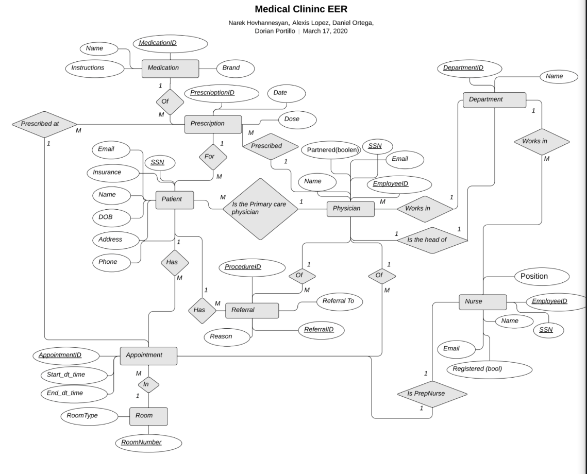

# Clinic-Database with MySQL

We have designed a backend relation database intended to be used with a proprietary application similar to Epic Systems with the goal of managing patients appointments, prescriptions and referrals, as well as interfacing with physician, nurse, and medication tables.

The relational datavase will handle all the inter-table constraints and foreign keys, as well as checking appointment times to ensure no scheduling overlaps exist, leaving the proprietary application with just managing access levels based on credentials and generating queries.

Our function specification for the utilities provided is as follows: 
1. Allows nurses to make, update, and cancel appointments for patients.
2. Allows physicians to make prescriptions and external referrals to other clinics or hospitals should the need for a specialist unavailable in the in the clinic arise.
3. Allow for the hiring and termination of nurses and physicians.
4. Allow for the creation of new departments and specialties to keep up with an expanding clinic.

